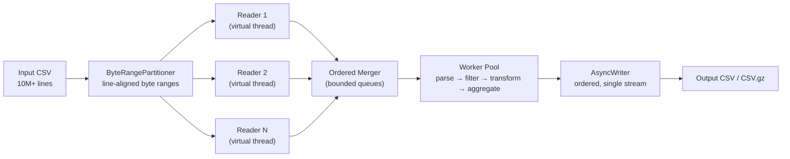

# JVM Performance Simulator

[](https://github.com/koraysrn/jvm-performance-simulator/actions/workflows/ci.yml)
[](https://openjdk.org/projects/jdk/21/)
[](https://maven.apache.org/)
[](LICENSE)

A high-throughput batch processor that streams **10M+ line CSV/log files** through a
chunked pipeline powered by **Java 21 Virtual Threads** and **Structured Concurrency**,
with **bounded memory**, **backpressure** and **immutable Records** — verified end-to-end
under a fixed `-Xmx256m` heap.

## Table of Contents

- [JVM Performance Simulator](#jvm-performance-simulator)
  - [Table of Contents](#table-of-contents)
  - [Features](#features)
  - [Architecture](#architecture)
  - [Requirements](#requirements)
  - [Getting Started](#getting-started)
  - [Usage](#usage)
  - [CLI Options](#cli-options)
  - [Input \& Output Format](#input--output-format)
  - [Memory Model](#memory-model)
  - [Testing](#testing)
  - [Project Structure](#project-structure)
  - [Tech Stack](#tech-stack)
  - [Roadmap](#roadmap)
  - [License](#license)

## Features

- **Virtual Threads & Structured Concurrency** — every stage (readers, merger, workers,
  writer) runs as a subtask of a single `StructuredTaskScope.ShutdownOnFailure`; no
  traditional thread pools.
- **Parallel byte-offset reading** — the file is split into line-boundary-aligned byte
  ranges scanned by multiple readers in parallel.
- **Bounded memory & backpressure** — every queue is a fixed-capacity
  `ArrayBlockingQueue`, so a slow stage blocks its producers instead of buffering
  unboundedly.
- **Immutable DTOs** — all cross-thread data objects are Java `record`s.
- **Ordered, single-writer output** — one async writer emits results in input order,
  with optional GZIP compression.
- **Overflow-safe aggregation** — `Math.addExact` guards the count and `double`
  semantics are explicit for sum/min/max/average.
- **Security hardening** — CSV formula-injection (CWE-1236) and log-injection
  (CWE-117) protection built in.
- **Spec-Driven Development guardrails** — [`intent.md`](intent.md),
  [`spec.md`](spec.md) and [`CLAUDE.md`](CLAUDE.md) are the single source of truth,
  enforced by ArchUnit tests in CI.
- **Observability** — Micrometer metrics and throughput reporting.

## Architecture



## Requirements

- **JDK 21** (e.g. Eclipse Temurin)
- **Maven 3.9+**

The build enables Java 21 preview features (`StructuredTaskScope`, `ScopedValue`) for
both compilation and tests.

## Getting Started

```bash
git clone https://github.com/koraysrn/jvm-performance-simulator.git
cd jvm-performance-simulator

# Compile, run all tests, enforce ArchUnit rules and the coverage gate
mvn clean verify
```

## Usage

```bash
mvn package

java --enable-preview \
  -cp target/jvm-performance-simulator-1.0.0-SNAPSHOT.jar \
  com.jvmsim.Main \
  --input data/input.csv \
  --output data/output.csv
```

Filter to ERROR/WARN records, scale values and compress the output:

```bash
java --enable-preview \
  -cp target/jvm-performance-simulator-1.0.0-SNAPSHOT.jar \
  com.jvmsim.Main \
  --input data/input.csv \
  --output data/output.csv.gz \
  --level ERROR,WARN \
  --value-scale 0.5 \
  --gzip
```

## CLI Options

| Option               | Default | Description                                      |
|----------------------|---------|--------------------------------------------------|
| `-i`, `--input`      | —       | Input CSV file path (required)                   |
| `-o`, `--output`     | —       | Output CSV file path (required)                  |
| `--chunk-size`       | 2000    | Raw lines per chunk                              |
| `--workers`          | 8       | Worker virtual threads (also reader count)       |
| `--queue-capacity`   | 32      | Bounded queue capacity (backpressure)            |
| `--gzip`             | false   | GZIP-compress the output                         |
| `--fail-fast`        | false   | Abort on the first malformed line                |
| `--level`            | —       | Comma-separated accepted levels                  |
| `--source`           | —       | Comma-separated accepted sources                 |
| `--min-value`        | —       | Inclusive lower bound for the numeric value      |
| `--max-value`        | —       | Inclusive upper bound for the numeric value      |
| `--value-scale`      | —       | Multiplication factor applied to values          |
| `--deadline-seconds` | 0       | Whole-run deadline (0 = no deadline)             |

## Input & Output Format

Five-column CSV: `timestamp, level, source, message, value`.

```csv
2026-10-04T20:00:00Z,INFO,auth-service,login ok,42.5
2026-10-04T20:00:01Z,ERROR,gateway,"request failed, timeout",-1.0
```

Fields follow RFC-4180 quoting. Blank lines are ignored; malformed lines are skipped and
counted by default, or abort the run with `--fail-fast`. Output preserves the input order
of records that passed the filter.

## Memory Model

The pipeline never loads the whole file. The maximum number of live raw lines is
bounded by:

```
live lines ≈ chunkSize × (queueCapacity × (workerCount + 1) + workerCount)
```

With the defaults (`2000 × (32 × 9 + 8) = 592k` lines) the resident data stays well
below `-Xmx256m`. The 10M-line stress test enforces this budget in CI.

## Testing

```bash
# Unit, integration, ArchUnit and coverage (stress tests excluded by default)
mvn clean verify

# Memory stress gate: 10M lines under -Xmx256m
mvn test -Dtest=MemoryStressTest -Dsurefire.excludedGroups=__none__

# Quick local stress check with fewer lines
mvn test -Dtest=MemoryStressTest -Dsurefire.excludedGroups=__none__ -Dstress.lines=100000
```

Coverage report: `target/site/jacoco/index.html`.

## Project Structure

```
src/main/java/com/jvmsim/
├── model/       immutable Record DTOs
├── io/          ByteRangePartitioner, RangeChunkReader, ChunkReader
├── parse/       CsvParser + malformed-line policy
├── process/     filter, transformer, aggregator, chunk processor
├── concurrent/  StructuredTaskScope orchestrator
├── output/      ordered asynchronous writer
├── metrics/     Micrometer summary metrics
├── config/      immutable pipeline configuration
└── cli/         picocli command bootstrap

src/test/java/com/jvmsim/
├── arch/        ArchUnit architecture rules
├── concurrent/  orchestrator + memory stress tests
├── io/          reader/partitioner tests
├── model/       record tests
├── output/      writer/backpressure tests
├── parse/       parser edge-case tests
└── process/     processing unit tests
```

## Tech Stack

| Layer          | Technology                                   |
|----------------|----------------------------------------------|
| Language       | Java 21 (preview: structured concurrency)     |
| Concurrency    | Virtual Threads, `StructuredTaskScope`, `ScopedValue` |
| Build          | Maven, Surefire, JaCoCo, ArchUnit             |
| CLI            | picocli                                      |
| CSV            | Apache Commons CSV                           |
| Metrics        | Micrometer                                   |
| Logging        | SLF4J + Logback                              |
| CI/CD          | GitHub Actions                               |

## Roadmap

Planned enhancements are tracked in [`docs/extra-features.md`](docs/extra-features.md).

## License

Distributed under the MIT License. See [`LICENSE`](LICENSE) for details.
